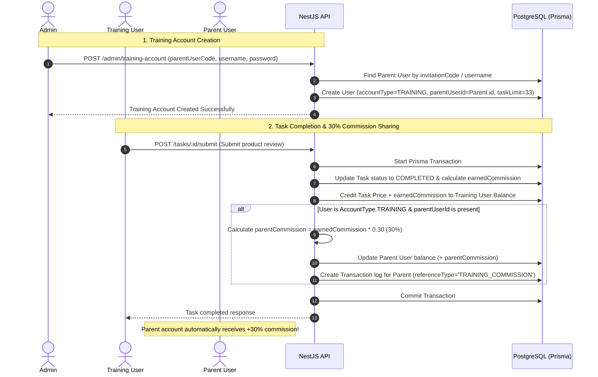

# Training Account Feature Specification & Implementation Plan

This document outlines the end-to-end technical specification, database schema alignment, business logic flow, NestJS backend implementation details, and API endpoints for the **Training Account & Automatic 30% Parent Commission Feature**.

---

## 1. Feature Overview & Requirements

### Key Objectives:
1. **Admin Training Account Provisioning**:
   - Admin can look up any existing user using their **User Code / Invitation Code** (or `username` / `userId`).
   - Admin creates a new **Training Account** linked directly to that target user (who becomes the **Parent Account**).
   - The training account receives standard user credentials (`username`, `password`) and an initial balance if required.
2. **33 Task Execution & Automatic Commission Sharing**:
   - The Training Account performs product tasks (default task limit: 33 tasks).
   - Upon completing tasks, **30% of the earned task commission** is automatically calculated and credited to the **Parent User's balance**.
   - Every commission share is logged in the `Transaction` table for audit, transparency, and financial tracking.

---

## 2. Database Schema Alignment (Prisma ORM)

The existing `prisma/schema.prisma` already supports parent-child relationships and account types:

```prisma
enum AccountType {
  MAIN
  TRAINING
}

model User {
  id                     String      @id @default(uuid())
  username               String      @unique
  invitationCode         String      @unique
  role                   Role        @default(USER)
  accountType            AccountType @default(MAIN)
  balance                Decimal     @default(0.00) @db.Decimal(12, 2)
  taskLimit              Int         @default(33)

  // Parent-Child Link for Training Accounts
  parentUserId           String?
  parentUser             User?       @relation("ParentChildAccounts", fields: [parentUserId], references: [id])
  childAccounts          User[]      @relation("ParentChildAccounts")

  // ... other existing fields
}
```

---

## 3. Detailed Business Logic Flow



---

## 4. API Endpoints Specification

### A. Admin API: Create Training Account by User Code

- **Endpoint**: `POST /api/v1/admin/training-account`
- **Access**: Admin / Agent (`JwtAuthGuard`, `RolesGuard(ADMIN, AGENT)`)
- **Request Body (DTO)**:

```json
{
  "parentUserCode": "INV78921",
  "username": "trainee_john",
  "password": "Password123!",
  "email": "john.trainee@example.com",
  "phone": "+155501928",
  "initialBalance": 100.00,
  "taskLimit": 33
}
```

- **Response (201 Created)**:

```json
{
  "success": true,
  "message": "Training account created successfully and linked to parent user INV78921",
  "data": {
    "id": "usr-uuid-1234",
    "username": "trainee_john",
    "accountType": "TRAINING",
    "parentUser": {
      "id": "parent-uuid-5678",
      "username": "parent_user",
      "invitationCode": "INV78921"
    },
    "balance": "100.00",
    "taskLimit": 33,
    "createdAt": "2026-10-03T21:30:00.000Z"
  }
}
```

---

### B. User Task Submission API (With 30% Commission Logic)

- **Endpoint**: `POST /api/v1/tasks/:id/submit`
- **Access**: User (`JwtAuthGuard`)
- **Request Body**:

```json
{
  "rating": 5,
  "comment": "Great product experience!"
}
```

- **Transaction Audit Log Entry Created for Parent User**:
  - `userId`: `parentUserId`
  - `type`: `CREDIT`
  - `amount`: `parentCommission` (30% of `earnedCommission`)
  - `referenceType`: `'TRAINING_COMMISSION'`
  - `referenceId`: `taskId`
  - `note`: `30% commission from training account (trainee_john) on task #1 (Earned: $3.00, Parent Share: $0.90)`

---

## 5. NestJS Backend Code Implementation Details

### Step 1: Update DTO (`src/admin/dto/admin.dto.ts`)

```typescript
export class CreateTrainingAccountDto {
  @ApiProperty({ example: 'INV78921', description: 'Parent user invitation code or username' })
  @IsString()
  @IsNotEmpty()
  parentUserCode: string;

  @ApiProperty({ example: 'trainee_john', description: 'Training account username' })
  @IsString()
  @IsNotEmpty()
  username: string;

  @ApiProperty({ example: 'trainPass123', description: 'Training account password' })
  @IsString()
  @IsNotEmpty()
  @MinLength(6)
  password: string;

  @ApiPropertyOptional({ example: 'trainee@example.com' })
  @IsOptional()
  @IsEmail()
  email?: string;

  @ApiPropertyOptional({ example: '+1555000111' })
  @IsOptional()
  @IsString()
  phone?: string;

  @ApiPropertyOptional({ example: 100.0, description: 'Initial balance for training account' })
  @IsOptional()
  @Type(() => Number)
  @IsNumber({ maxDecimalPlaces: 2 })
  @Min(0)
  initialBalance?: number;

  @ApiPropertyOptional({ example: 33, description: 'Task limit allocation (default 33)' })
  @IsOptional()
  @Type(() => Number)
  @IsNumber()
  @Min(1)
  taskLimit?: number = 33;
}
```

---

### Step 2: Implement Admin Service Method (`src/admin/admin.service.ts`)

```typescript
async createTrainingAccountByCode(dto: CreateTrainingAccountDto) {
  // 1. Search for Parent User by invitationCode or username
  const parentUser = await this.prisma.user.findFirst({
    where: {
      OR: [
        { invitationCode: dto.parentUserCode },
        { username: dto.parentUserCode },
        { id: dto.parentUserCode },
      ],
    },
  });

  if (!parentUser) {
    throw new NotFoundException(`Parent user with code/username '${dto.parentUserCode}' not found`);
  }

  // 2. Check duplicate username/email/phone for new account
  const existingUser = await this.prisma.user.findFirst({
    where: {
      OR: [
        { username: dto.username },
        ...(dto.email ? [{ email: dto.email }] : []),
        ...(dto.phone ? [{ phone: dto.phone }] : []),
      ],
    },
  });

  if (existingUser) {
    throw new ConflictException('Username, email, or phone is already registered');
  }

  // 3. Hash password and generate invite code
  const passwordHash = await bcrypt.hash(dto.password, 10);
  let inviteCode = this.generateUniqueInviteCode();
  while (await this.prisma.user.findUnique({ where: { invitationCode: inviteCode } })) {
    inviteCode = this.generateUniqueInviteCode();
  }

  // 4. Create Training Account
  const trainingUser = await this.prisma.user.create({
    data: {
      username: dto.username,
      email: dto.email || null,
      phone: dto.phone || null,
      passwordHash,
      role: Role.USER,
      accountType: AccountType.TRAINING,
      parentUserId: parentUser.id,
      balance: new Prisma.Decimal(dto.initialBalance || 0),
      taskLimit: dto.taskLimit || 33,
      invitationCode: inviteCode,
    },
    select: {
      id: true,
      username: true,
      email: true,
      phone: true,
      role: true,
      accountType: true,
      parentUserId: true,
      balance: true,
      taskLimit: true,
      invitationCode: true,
      createdAt: true,
      parentUser: {
        select: {
          id: true,
          username: true,
          invitationCode: true,
        },
      },
    },
  });

  return trainingUser;
}
```

---

### Step 3: Implement Commission Sharing in Tasks Service (`src/tasks/tasks.service.ts`)

Inside `submitTask(userId: string, taskId: string, dto: SubmitTaskDto)` within `prisma.$transaction`:

```typescript
// --- Existing Task Completion Logic ---
const balanceBefore = new Prisma.Decimal(user.balance.toString());
const commissionRate = new Prisma.Decimal(task.commissionSnapshot.toString());

// earnedCommission = priceSnapshot * (commissionRate / 100)
const earnedCommission = priceSnapshot.mul(commissionRate).div(100);
const totalCreditAmount = priceSnapshot.add(earnedCommission);
const balanceAfter = balanceBefore.add(totalCreditAmount);

// Credit balance to Training User
await tx.user.update({
  where: { id: userId },
  data: { balance: balanceAfter },
});

// Update Task status to COMPLETED
const completedTask = await tx.productTask.update({
  where: { id: taskId },
  data: {
    status: TaskStatus.COMPLETED,
    earnedCommission,
    rating: dto.rating,
    comment: dto.comment || null,
    completedAt: new Date(),
  },
  include: { product: true },
});

// Log Task Completion Transaction for Training User
await tx.transaction.create({
  data: {
    userId,
    type: TransactionType.CREDIT,
    amount: totalCreditAmount,
    balanceBefore,
    balanceAfter,
    referenceType: 'TASK_COMPLETE',
    referenceId: taskId,
    note: `Completed product task #${taskId.substring(0, 8)} - refunded price ($${priceSnapshot}) + commission ($${earnedCommission})`,
  },
});

// --- NEW: AUTOMATIC 30% PARENT COMMISSION DISTRIBUTION ---
if (user.accountType === AccountType.TRAINING && user.parentUserId) {
  const PARENT_COMMISSION_PERCENT = 30; // 30%
  const parentCommission = earnedCommission.mul(PARENT_COMMISSION_PERCENT).div(100);

  if (parentCommission.gt(0)) {
    const parentUser = await tx.user.findUnique({
      where: { id: user.parentUserId },
    });

    if (parentUser && parentUser.isActive) {
      const parentBalanceBefore = new Prisma.Decimal(parentUser.balance.toString());
      const parentBalanceAfter = parentBalanceBefore.add(parentCommission);

      // 1. Credit Parent Balance
      await tx.user.update({
        where: { id: user.parentUserId },
        data: { balance: parentBalanceAfter },
      });

      // 2. Audit Log for Parent Transaction
      await tx.transaction.create({
        data: {
          userId: user.parentUserId,
          type: TransactionType.CREDIT,
          amount: parentCommission,
          balanceBefore: parentBalanceBefore,
          balanceAfter: parentBalanceAfter,
          referenceType: 'TRAINING_COMMISSION',
          referenceId: taskId,
          note: `Received 30% commission ($${parentCommission}) from child training account (${user.username}) on task #${task.stepNumber}`,
        },
      });
    }
  }
}
```

---

## 6. Calculation Example

| Parameter | Value |
| :--- | :--- |
| **Product Price** | $500.00 |
| **Commission Rate** | 2.0% |
| **Training Account Earned Commission** | $500.00 × 2.0% = **$10.00** |
| **Parent Commission Rate** | **30%** |
| **Parent Automatic Credit** | $10.00 × 30% = **$3.00** |
| **Training Account Balance Credit** | $500.00 (refund) + $10.00 (commission) = **$510.00** |
| **Parent Account Balance Credit** | **+$3.00** |

---

## 7. Frontend Integration Guidelines

1. **Admin Panel**:
   - Add a form field: **"Parent User Code / Invitation Code"**.
   - Include auto-complete / search preview so the admin can verify the Parent User name before creating the training account.
2. **Parent User Dashboard**:
   - In the **Transaction History** section, display transactions with type `TRAINING_COMMISSION` with a label e.g., `+ $3.00 (Training Bonus from @trainee_john)`.
3. **Training Account Dashboard**:
   - Show a badge e.g., `[TRAINING ACCOUNT]` in the profile header so the user knows they are executing tasks on a training account.

---

## 8. Verification & Test Strategy

1. **Unit & Integration Tests**:
   - Create a parent user with $0 balance.
   - Admin creates a training account referencing parent's `invitationCode`.
   - Execute task completion for training account.
   - Assert parent balance increases by exactly 30% of task commission.
   - Assert `Transaction` records exist for both training account and parent account.
2. **Edge Cases Handled**:
   - If Parent user is inactive (`isActive = false`), commission distribution is safely skipped without throwing error or corrupting the main task completion transaction.
   - High concurrency / atomic execution via `prisma.$transaction`.
